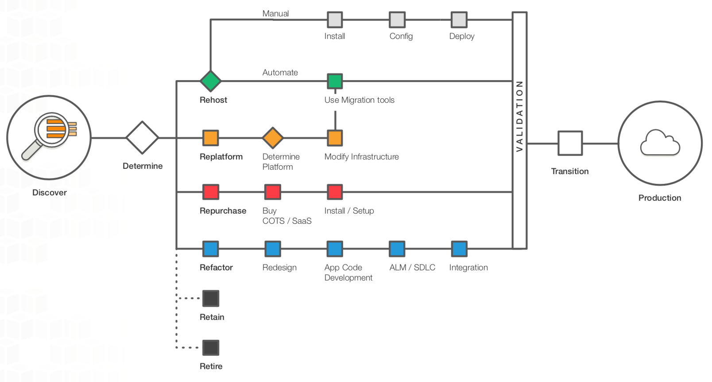

# 云迁移策略

云计算经过多年的产品能力完善、云产品持续新增和稳定性逐步增强，使得大家已经能够广泛接受云计算的理念并积极思考如何在自身业务中使用云计算。

## 制定迁移策略

企业通常在“迁移过程”的第二个阶段（准备和计划）开始考虑如何迁移应用程序。此时企业会确定其环境中存在的应用程序、这些应用程序的相互依赖性、哪些应用程序容易迁移、哪些应用程序难以迁移，以及如何迁移各个应用程序。

利用这些知识，组织可以草拟出一个方案 (在迁移和学习的过程中应该考虑其会受到哪些变更的影响)，了解将如何迁移其产品组合中的每个应用程序以及以何种顺序迁移。

迁移现有应用程序的复杂性因架构和现有的许可安排而有所不同,建议从复杂度较低的应用程序开始迁移，理由很明显，即迁移更容易完成 — 这将在您学习时为您提供一些直接的正面强化效果 (即“速效方案”)。

## 6个不同的迁移策略

那么应用迁移上云应该如何操作，2011年 Gartner 的分析师提出了 5R 策略，随着后续的不断发展和补充，目前迁移上云的策略被一般认为为 6R 策略，即本文将要介绍的六种云迁移策略。

### Rehost 重新托管，也称为 “直接迁移”
> Rehost (lift and shift) – Move an application to the cloud without making any changes to take advantage of cloud capabilities.

这个是应用进行云迁移时最常见的策略，即对应用程序运行环境不做改变的情况下迁移上云， 一般的操作是 P2V（Physical to Virtual，物理机迁移至虚拟机）、V2V（Virtual to Virtual，虚拟机迁移至虚拟机）。在企业期望快速上云或大型应用上云的场景中，这种策略比较合适。

迁移复杂度：中

### Replatform 更换平台，也称为 “修补后迁移”
> Replatform (lift and reshape) – Move an application to the cloud, and introduce some level of optimization to take advantage of cloud capabilities. 

在这个阶段，您可能要进行一些云 (或其他) 优化以获得一些有形的收益，但您不能更改应用程序的核心架构。您可能希望通过以下方法缩短用于管理数据库实例的时间：迁移到数据库即服务平台，如RDS（Relational Database Service），或将应用程序迁移到完全托管的平台。

一家大型媒体公司将其在本地运行的数百个 Web 服务迁移到了云上，在这个过程中，它从 WebLogic (一个需要价格高昂的许可证的 Java 应用程序容器) 迁移到了 Apache Tomcat (一个开源的等效容器)。除了从迁移到云上所获得的成本节省和敏捷性，这家媒体公司还节约了数百万元的许可成本。

迁移复杂度：高

### Repurchase 重新购置，也称为 “放弃后购买”
> Repurchase (drop and shop) – Switch to a different product, typically by moving from a traditional license to an SaaS model.

是指放弃使用原先的产品，改为采购新的替代产品，例如原先企业采用传统软件许可模式的人力资源管理系统，将放弃并选用同类 SaaS 产品来进行替换，抑或是选用了该厂商的 SaaS 版本。

如将 CRM 迁移到 Salesforce.com，将 HR 系统迁移到 Workday，将 CMS 迁移到 Drupal，诸如此类

迁移复杂度：中

### Refactor/Re-Architect 重构/重新构建
> Refactor/re-architect – Move an application and modify its architecture by taking full advantage of cloud-native features to improve agility, performance, and scalability. This typically involves porting the operating system and database. 

改变应用的架构和开发模式，进行云原生的应用服务实现，例如单体应用向微服务架构改造，这种策略一般是在现有应用环境下难以满足日后功能、性能或规模上的需求时采用，该策略的迁移成本最高，但是长远来看会更为满足未来的需求。

迁移复杂度：高

### Retain 保留
> Retain (revisit) – Keep applications in your source environment. These might include applications that require major refactoring, and you want to postpone that work until a later time, and legacy applications that you want to retain, because there’s no business justification for migrating them.

在部分应用或者业务未做好上云准备，或是更为适合本地部署时，保留现状，不强行进行迁移上云操作。

### Retire 停用
> Retire – Decommission or remove applications that are no longer needed in your source environment.

确定不再使用当前的基础设施，表明这部分系统或应用已经没有使用价值且还在持续消耗资源，应该进行必要的归档备份后停用。

## 展望

总之，应用迁移需要相应的策略。应用迁移该有优先级设定，根据业务发展实际需要来进行操作。企业级应用迁移具有其复杂性，需要专业人员的参与。
